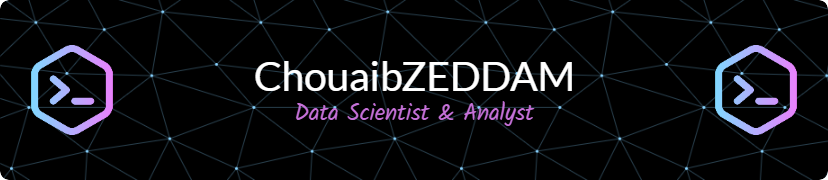

<h1 align="center">
    
</h1>

<table style="width: 100%; border-collapse: collapse; border: none !important;">
    <tr>
        <td style="width: 70%; vertical-align: middle; font-size: 16px; border: none !important;">
            

                I'm a <strong>Data Science and Analytics student</strong> and a passionate <strong>Full-Stack Developer</strong>.
                I enjoy building data-driven solutions and creating dynamic applications that solve real-world problems.
            

            <ul>
                <li>🔍 Transforming raw data into meaningful, actionable insights for data-driven decision-making.</li>
                <li>💻 Building scalable and high-performance web applications using modern technologies.</li>
                <li>🚀 Continuously learning and experimenting with the latest tools and frameworks to enhance development practices.</li>
            </ul>
            
        </td>
        <td style="width: 30%; vertical-align: middle; border: none !important;">
            
        </td>
    </tr>
</table>

### 🌟 About Me

- 🔍 Interested in **Data Science**, **Web Development**, and **Freelance Projects**.
- 🌐 Passionate about leveraging technology to craft innovative and efficient solutions.
- 📈 Always looking for opportunities to collaborate on impactful projects.

### 📫 How to reach me

- **Email:** [chouaiba629@gmail.com](mailto:chouaiba629@gmail.com) / [c.zeddam@univ-alger.dz](mailto:c.zeddam@univ-alger.dz)
- **Phone:** +213 670 289 077

## Connect with me

    
    

## Languages and Tools

### Languages

| C | HTML | CSS | JS | PHP | Java | Python | Dart | Kotlin | XML |
| --- | --- | --- | --- | --- | --- | --- | --- | --- | --- |
|   |  |  |  |  |  |  |  |  |  |

### Frameworks and Libraries

| Bootstrap | Tailwind | React | FLutter | Node.js | Vite | Laravel | Hadoop |
| --- | --- | --- | --- | --- | --- | --- | --- |
|  |  |  |  |  |  |  |  |

### Frameworks and Libraries for Python3

| Numpy | Pandas | Sklearn | Keras | OpenCV | Streamlit | Gekko | Beautiful Soup | Selenium | Tensoflow |
| --- | --- | --- | --- | --- | --- | --- | --- | --- | --- |
|   |   |   | |  |  |  |  |  |  |

### Databases and Backend

| MySQL | Firebase | MongoDB |
| --- | --- | --- |
|  |  |   |

### Development Environments

| VS Code | Android Studio | Gitpod |
| --- | --- | --- |
|  |  |  |

### OS

| MacOS | Ubuntu | Windows |
| --- | --- | --- |
|  |  |  |

### Other

| Git | Github | WordPress | OracleAPEX | Matlab | UML |
| --- | --- | --- | --- | --- | -- |
|  |  |  |  |  |  |

---
  

  

  
  

<picture>
  <source media="(prefers-color-scheme: dark)" srcset="https://raw.githubusercontent.com/tobiasmeyhoefer/tobiasmeyhoefer/output/github-snake-dark.svg" />
  <source media="(prefers-color-scheme: light)" srcset="https://raw.githubusercontent.com/tobiasmeyhoefer/tobiasmeyhoefer/output/github-snake.svg" />
  
</picture>

<!--
**chouaib-629/chouaib-629** is a ✨ _special_ ✨ repository because its `README.md` (this file) appears on your GitHub profile.

Here are some ideas to get you started:

- 🔭 I’m currently working on ...
- 🌱 I’m currently learning ...
- 👯 I’m looking to collaborate on ...
- 🤔 I’m looking for help with ...
- 💬 Ask me about ...
- 😄 Pronouns: ...
- ⚡ Fun fact: ...
-->
